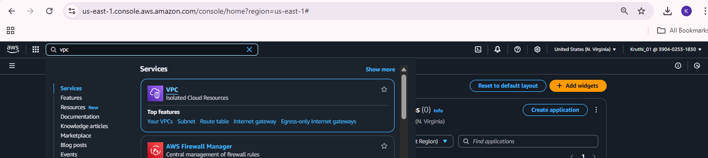
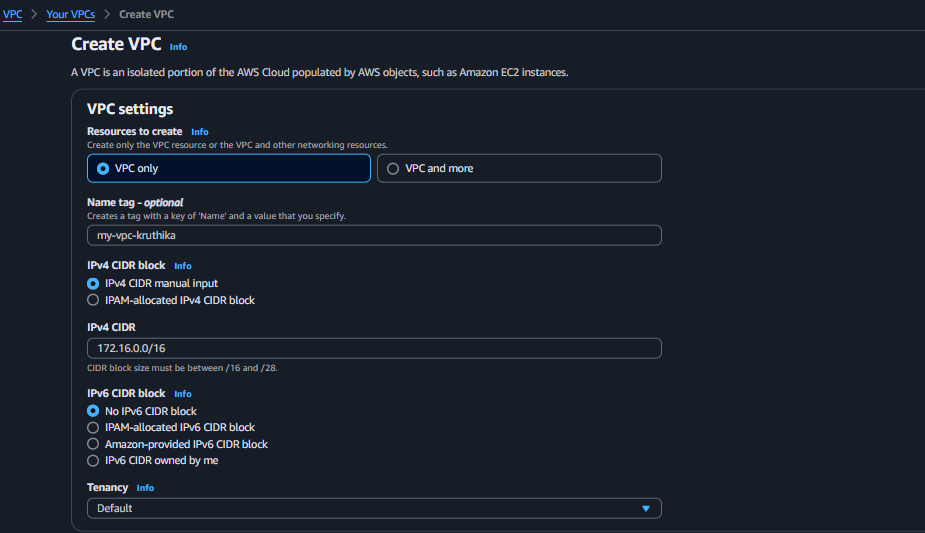
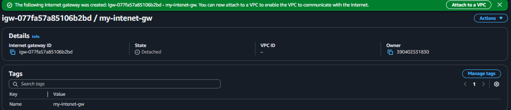
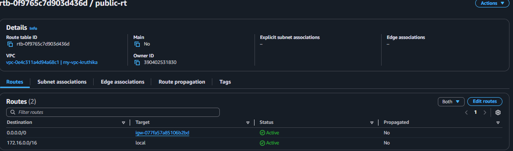
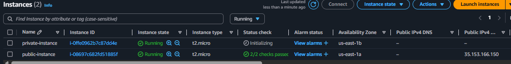

   

### 1. Create a VPC (Select a region, create a VPC by assigning 65536 IP’s (using CIDR range)) 
  
  
  1. Select region and search VPC.
  2. Click on VPC 
  3. Click on create VPC.
  4. In VPC settings
   * Resources to create --> VPC only
   * Name tag --> my-vpc-kruthika
   * IPv4 CIDR --> 172.16.0.0/16
   * IPv6 CIDR block --> No IPv6 CIDR block

     

   * Click on create VPC

      
           "VPC created"

### 2. Create Public subnet & Private subnet in different AZ's.     
    
   1. Subnets
   2. Create subnet
   3. Choose VPC ID (Create subnets in this VPC)
       
   4. Subnet settings
      * Subnet name --> public-subnet
      * Availability Zone(Choose the zone in which your subnet will reside) --> United states(N.Virginia) / us-east-1a
      * IPv4 subnet CIDR block --> 172.16.1.0/24
           
        
   5. Subnet settings
      * Subnet name --> private-subnet
      * Availability Zone(Choose the zone in which your subnet will reside) --> United states(N.Virginia) / us-east-1b
      * IPv4 subnet CIDR block --> 172.16.2.0/24
        

   6. Click on create subnet

       
       "Subnets created"

### 3. Create a Internet Gateway, attach the same to the VPC. 

   1. Internet gateways
   2. click on internet gateway.
   3. Internet gateway settings
      * Name tag --> my-intenet-gw
   4. click on create igw

      
      "igw created"

      * Here the state is dettached to enable the VPC to communicate with internet the state should be attach.

   5. Click on attach to VPC
   6. Select the VPC to be attached 
   7. Click on attach igw

      

### 4. Create Route table for public and private & associate them, Add the Internet Gateway to the Public subnet route table      
   
   1. Route tables
   2. Create route table 
   3. Route table settings
      * Name --> public-rt
      * VPC --> select vpc
   4. create rt

   5. Route table (connection from public rt to igw)
   6. (select voc)Route  
   7. Edit routes
   8. Add routes
      * 0.0.0.0/0 --> igw (select igw id)

       
   9. Associate public subnet to public rt
      * Route table
      * subnet associations
      * edit subnet associations
      * Available subnets --> public-subnet 
      * save    

         

### 5. Create an EC2 instance in Public subnet, install nginx and see if you can access. 

   1. EC2
   2. Launch public instances.
      * Name --> Public instance
      * AMI --> Amazon Linux
      * Instance type  --> t2.micro
      * key pair --> create new (.ppk) 
      * Network settings 
        * VPC
        * Subnet --> public
        * Auto-assign public IP -->Enable
        * Firewall (security groups)--> create new
        * Security group name --> pro-sg
        * Inbound Security Group Rules -->
           * Type --> ssh
           * Source type --> my ip
           * Port range --> 22

           * Type --> http
           * Source type --> anywhere
           * Port range --> 80
   3. Launch instance

   4. Launch private instances.
      * Name --> Private instance
      * AMI --> Amazon Linux
      * Instance type  --> t2.micro
      * key pair --> create new (.ppk) 
      * Network settings 
        * VPC
        * Subnet --> private
        * Auto-assign public IP -->disable
        * Firewall (security groups)--> create new
        * Security group name --> pro-sg
        * Inbound Security Group Rules -->
           * Type --> ssh
           * Source type --> anywhere
           * Port range --> 22

           * Type --> http
           * Source type --> anywhere
           * Port range --> 80

        

### 6.  Create an EC2 instance in Public subnet, install nginx and see if you can access.

   1. EC2 instance created
   2. To install nginx 
      * Open & connect to command prompt terminal
      * ssh -i key.pem ec2-user@<public-instance-ip>
      * sudo yum update -y
      * sudo amazon-linux-extras enable nginx1
      * sudo yum install nginx -y
      * sudo systemctl start nginx
      * sudo systemctl enable nginx

   3. Access the public instance via browser using http://public-instance-ip
       
       

### 7. Create an EC2 instance in Private subnet, try to access the private instance through the instance in public subnet(Clue: using ssh )

   1. Created a EC2 instance in private subnet.
   2. In  terminal login as
      ssh -i "my-kp.pem" ec2-user@private-instance-id

    
 
  