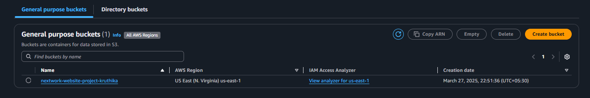

# Create a bucket in Amazon S3

* This is where we store the files
* It allows users to store and retrieve any amount of data from anywhere on the web.

## Today's project architecture diagram
   

## 1. Log in to AWS Console and search S3
   

1. Select AWS region.
2. Choose create Bucket.
3. Bucket type --> General purpose
4. Bucket name should be unique.
   Bucket name --> nextwork-website-project-kruthika
5. Object Ownership --> ACLs enabled 

   

### ACLs (Access Control Lists)
* what are ACLs (Access Control Lists)?
--> An ACL = a set of rules that decides who can get access to a resource.

* Enabling ACLs in this S3 setup lets you control who can access and do things with the objects (i.e. website files) you upload into your bucket.

* With ACLs, different AWS accounts can own and control different files in your bucket.

6. Object Ownership --> Bucket owner preferred
7. Block Public Access settings for this bucket --> Untick everything (because I want to host in public)

   

* Check the box that says “I acknowledge that the current settings might result in this bucket and the objects within becoming public.”

8. Bucket Versioning --> Enable
9. Choose create bucket.

   

## 2. Upload website content to your bucket

* In the Buckets section, choose the name of your new bucket.

* Upload the files into your bucket.
  * index.html
  * NextWork - Everyone...love_files.zip
  * Unzip the zip file you've downloaded

  1. Return to the Amazon S3 console with your bucket page open. Choose the Objects tab.
  2. Choose Upload.
  3. Choose Add files.
  4. Choose index.html
  5. Choose Add folder.
  6. Choose the unzipped folder - NOT the zip file itself!
  * You might get a popup that tells you that all files in that folder will be uploaded.
  7. Choose Upload.

     

  * Files uploaded

     

  * Successful upload of your files to your S3 bucket.

     

 ## 3. Configure a static website on Amazon S3

* let's make our website available on the internet by  setting up static website hosting!

* What does website hosting mean?
--> Website hosting is what makes your website public on the internet.

* Even if you perfect an HTML file, no one else can see it when it's stored as a local file on your computer! Website hosting = storing your HTML file (and the other files for your website) on a web server, so it's accessible online.

* By configuring your S3 bucket for hosting, we're telling this bucket: "please create a URL that will take anyone to a page that displays the HTML file I just uploaded."

1. Go inside your bucket.
2. Choose the Properties tab.
3. Scroll all the way down to the Static website hosting panel.
4. Choose Edit.
5. Configure the following settings:
  * Static web hosting: Choose Enable.
  * Hosting type: Choose Host a static website.
  * Index document: Enter index.html

  
   "Where to set your S3 bucket to enable static website hosting".
 
  * Choose Save changes.

6. In the Static website hosting panel, click on the URL under Bucket website endpoint.

  * What's a bucket website endpoint?
  --> A bucket website endpoint is just like a regular website URL. It lets people visit your S3 bucket as a website.

   
     
   
      "An error!"

  * Why did I get this error?
  --> Objects (in this case, the HTML and images files you uploaded) are private by default. This default setting helps keep your account's data secure.

  * The error message you're seeing is telling me that my static website is being hosted by S3, but the actual HTML/image files I've uploaded are still private. It's kind of like having a bucket on display, so everyone can see the bucket - but the contents are covered up, preventing anyone from seeing what's inside.

  * To solve this error, I need to set the permission of the objects to public - this is why I enabled ACLs in Task 1!

## 4.Make objects in my S3 bucket public

 1. head to the Objects tab.
 2. Select the checkboxes next to your index.html file and the folder of website assets.
 3. In the Actions dropdown, choose Make public using ACL.

    
    "Where to make your files public using ACL".

    
    "Sucessfully made files public using ACL".

 4. Return to the web browser tab that has the 403 Forbidden message
 5. Refresh the tab.

 * Bucket website endpoint -->
   http://nextwork-website-project-kruthika.s3-website-us-east-1.amazonaws.com

   
  "Error in uploading folder(upload subfolder without macos)" 

    
   "Website is successfully hosted!"

## 5. Delete your resources

   1. To delete an S3 object, head back to your browser tab with the AWS Management Console.
   2. Select the Objects tab.
   3. Select the checkboxes next to the three objects in your bucket, and choose Delete.
   4. Type delete to confirm.
   5. Select Delete objects.

